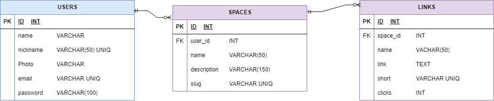

# Rasus API

La API de Rasus proporciona un conjunto de herramientas para integrar un acortamiento de enlaces en Rasus. la API fue testeada con postman y es consumida por un Frontend en React, ademas, esta versionada y cuenta con bearer API token.

## Frontend:
### https://github.com/stivenm0/rasus_frontend 

## Tecnologías Utilizadas
- Laravel
- MySQL

## DB 

